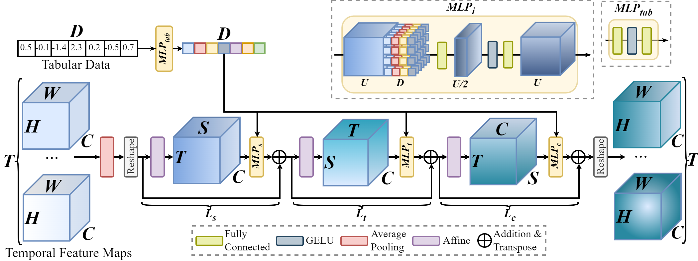

# TabMixer: Noninvasive Estimation of the Mean Pulmonary Artery Pressure via Imaging and Tabular Data Mixing



### TabMixer module

TabMixer can be seamlessly integrated within any CNN as an intermediate layer. Basic usage:

```python
import torch
from src.models.modules import TabMixer

x_input = torch.randn(1, 8, 16, 32, 32)  # B,C,F,H,W
tab_input = torch.randn(1, 6)  # 6 tabular features

module = TabMixer(channel_dim=8, frame_dim=16, hw_size=(32, 32), tab_dim=6)
module(x_input, tab_input)
```

### Repository details

In this repository we provide the code for using TabMixer integrated with 3D CNNs, Transformers and all-MLP
architectures. We provide the training
script with validation code in _src\train.py_ and data loader with data augmentations in src\data_augmentation.
The code used for generating results for tabular-based methods are presented in _ml\_methods.py_ and
_train_pytorch_frame.py_. All SOTA methods and models that we used during experiments are available in
src/models/... files. We provide pretrained weights of
I3D [here](https://www.dropbox.com/scl/fi/4pf5g84a4s2h1wyi9430f/inception.pt?rlkey=ff85elk3yksm8a4hsy9icnwvc&dl=0) and
I3D+TabMixer [here](https://www.dropbox.com/scl/fi/yv8yrd616qqvufue2bv10/inception_tabmixer.pt?rlkey=5l3l398od40297x9oxnov0ypy&dl=0).

To run the training code with default parameters, prepare the dataloader and run:

```shell
cd src
python train.py
```

